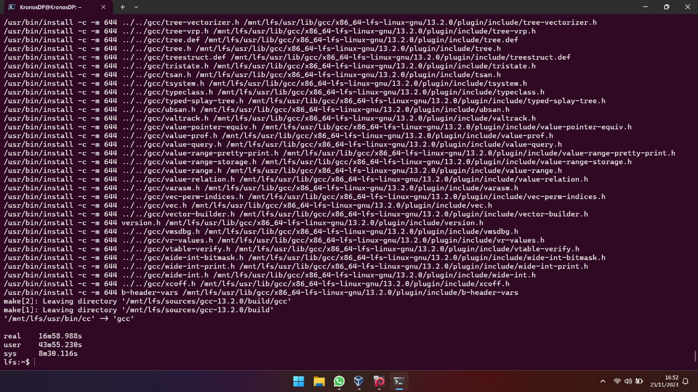
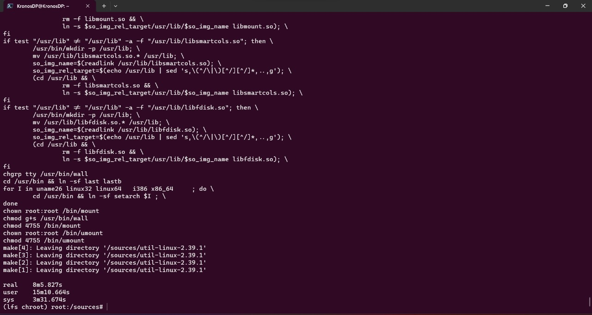
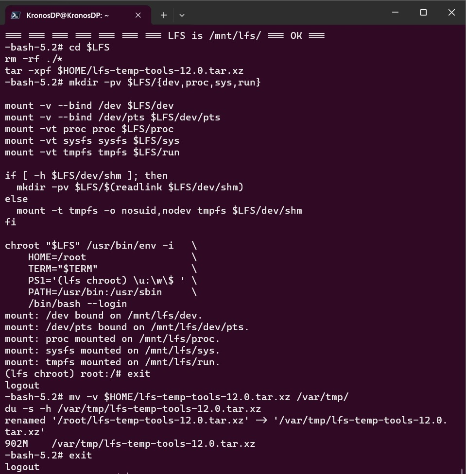
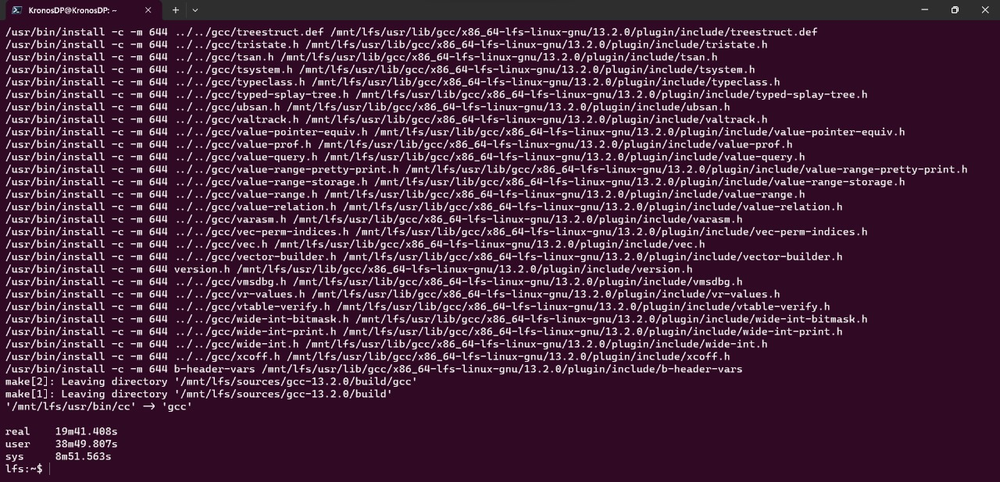
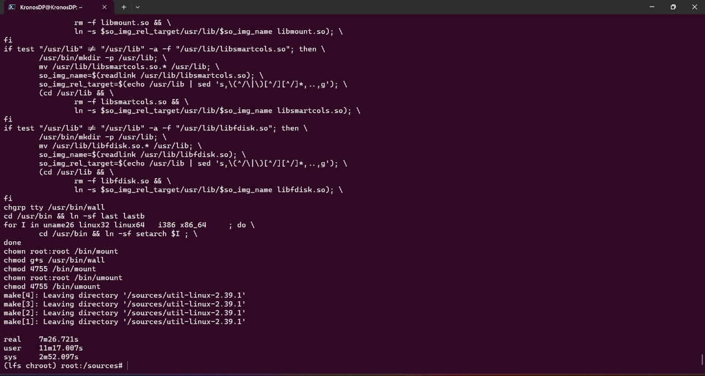
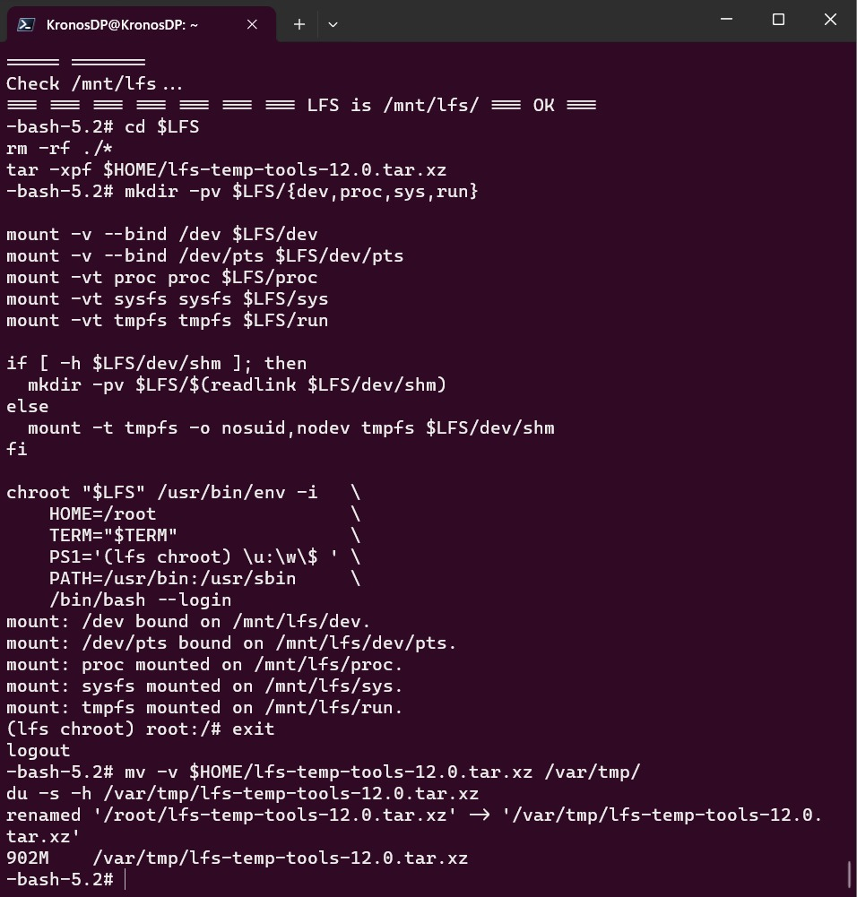

# Notes
My notes for Chapter 8 of Linux From Scratch - Week 10 of my Operating System Course

#### Scripts:
There are no scripts. Only copy paste stuffs

# Important
This script still need some testing, please do not run this first (except you want to help me test this, please do help me in testing this script :D)

*PLEASE AND I DO MEAN PLEASE READ THE WHOLE THING AND UNDERSTAND IT. DON'T JUST COPY PASTE IT. YOU HAVE BEEN WARNED. I HAVE SPOKEN*

# Disclaimer
*The sentence on this part is arguably the most important sentence on this webpage. There is no guarantee or any warranty that this will work for the first time. Please (and I really do mean PLEASE) UNDERSTAND EACH AND EVERYTHING THAT YOU TYPE ON YOUR TERMINAL*. You don't want to waste hours of time do you?

# Optimization Problem (optional but very interesting)
*This thing can speed up this week's compilation process*. If you don't want to waste your time, please use more than 4 cores (if your laptop has more than 4 cores). Either ways *skip this part if you don't bother or you have only 4 cores*. 

I don't know, haven't explored it yet but I think we can use 6 cores when compiling this chapter. I'm not really sure tho. The only thing that I'm sure of is that I tried to compile chapter 6 with 6 cores and it speeds it up (my cpu utilization on my task manager (not top on my linux)) increased. The problem is that I don't know if it finished compiling faster. The only thing I know is that when compiling a certain package (I forgot which one is it but I think it's gcc. I'm not sure tho) it takes 1-2 minutes being stuck. Because of that, I stop the compilation process and I think that failed.

Maybe I'm not patient enough, maybe multicore doesn't work. Either ways, try it! It's the only way to find out right? If you want to do 6 cores build of the LFS, go to the setting on your virtual box and go to system. After that, go to processors and increase your core.

Note that I'm having 6 cores on my laptop. If you want to try compiling your linux with more core, remember to set your `MAKEFLAGS` to `-jn` where n is the number of cores you want to use.

Here's how:
```bash
export MAKEFLAGS='-j6'
```


Then check your “LFS”, “ARCH”, “NPROC”, and “MAKEFLAGS” environment variables for root

```bash
echo "LFS=\"$LFS $(df $LFS|tail -1|awk '{print $1,int($2/1000000)"G"}')\" ARCH $(arch) NPROC=$(nproc) MAKEFLAGS=$MAKEFLAGS"
```

output should be (assuming you're using 6 cores) 
```
LFS="/mnt/lfs /dev/sdb2 32G" ARCH x86_64 NPROC=6 MAKEFLAGS=-j6
```

Because chroot is still primitive (translation: we still haven't compile too much thing so yeah, I'll call that primitive) we want to just check NPROC and MAKEFLAGS.

```bash
echo "NPROC=$(nproc) MAKEFLAGS=$MAKEFLAGS"
```

Number of core and makeflags should be the same with what you've set before.

## Update on Compiling on More core

After doing some extensive tests today (25th November 2023) that takes a whole day of mine (it's okay tho, I enjoyed it :D) I managed to get some interesting result. I get that we *can* do build on more cores to speed up the build process. Here are some images and it's caption.

### Using 6 Cores

This is the end of chapter 6 build screenshot with it's time. Note that here *I am using 6 cores and 8GB ram on virtualbox.* My physical ram is 16GB.



The picture of end of chapter 7. Still, *6 cores, 8GB ram on virtualbox.*



Final backup tarball size with 6 cores and 8GB ram



### Using 4 Cores

This is the end of chapter 6 build screenshot with it's time. Note that here *I am using 6 cores and 8GB ram on virtualbox.* My physical ram is 16GB.



The picture of end of chapter 7. Still, *4 cores, 4GB ram on virtualbox.*



Final backup tarball size with 4 cores and 4GB ram



# Story of the Mysterious Variance of Tarball size

I noticed something on my backup tarball after doing week 9. It is different. The cause is I try to compress tarball like this:

```bash
tar -I 'xz -T0' -cpvf $HOME/lfs-temp-tools-12.0.tar.xz .
```

The `-T0` is for the `xz` to use all available threads for the compression process.

My working hypothesis is that is the reason why my tarball size with more cores is significantly bigger than the one with the usual tarball script. I don't know if this is true or if this is false. But you do you brother.

p.s. Sorry for the long story :D. The part below is where we start working on week 10.


# Setup for Chapter 8
Note that this part is taken from my friend's [github](https://github.com/riorio805/os232/blob/master/NOTES/lfsch8s0-5.md?plain=1). Kudos to him.

## 8.0.S Entering chroot environment
#### Run as `root`
Set `$LFS` variable
```bash
export LFS=/mnt/lfs
```
Check `$LFS` variable (make sure OK)
```bash
echo "===== ======="
echo "Check $LFS..."
if   [ -z $LFS  ] ; then 
  echo ERROR: There is no LFS variable  === ERROR ===
elif [ -d $LFS/ ] ; then
  echo === === === === === === ===  LFS is $LFS/ === OK ===
else
  echo ERROR: There is no LFS directory === ERROR ===
fi
```

Enter chroot environment

```bash
chroot "$LFS" /usr/bin/env -i   \
    HOME=/root                  \
    TERM="$TERM"                \
    PS1='(lfs chroot) \u:\w\$ ' \
    PATH=/usr/bin:/usr/sbin     \
    /bin/bash --login
```

Output should be
```
(lfs chroot) root:/#
```
when you do ls it should be 
```
bin   dev  home  lib64       media  opt   root  sbin     srv  tmp  var
boot  etc  lib   lost+found  mnt    proc  run   sources  sys  usr
```

## 8.0.X Pre-flight Checks
Make sure you are in
`(lfs chroot) root:/# |`
Create `version-check.sh` (from LFS book section 2.2)
```bash
cd /
cat > version-check.sh << "EOF"
#!/bin/bash
# A script to list version numbers of critical development tools

# If you have tools installed in other directories, adjust PATH here AND
# in ~lfs/.bashrc (section 4.4) as well.

LC_ALL=C 
PATH=/usr/bin:/bin

bail() { echo "FATAL: $1"; exit 1; }
grep --version > /dev/null 2> /dev/null || bail "grep does not work"
sed '' /dev/null || bail "sed does not work"
sort   /dev/null || bail "sort does not work"

ver_check()
{
   if ! type -p $2 &>/dev/null
   then 
     echo "ERROR: Cannot find $2 ($1)"; return 1; 
   fi
   v=$($2 --version 2>&1 | grep -E -o '[0-9]+\.[0-9\.]+[a-z]*' | head -n1)
   if printf '%s\n' $3 $v | sort --version-sort --check &>/dev/null
   then 
     printf "OK:    %-9s %-6s >= $3\n" "$1" "$v"; return 0;
   else 
     printf "ERROR: %-9s is TOO OLD ($3 or later required)\n" "$1"; 
     return 1; 
   fi
}

ver_kernel()
{
   kver=$(uname -r | grep -E -o '^[0-9\.]+')
   if printf '%s\n' $1 $kver | sort --version-sort --check &>/dev/null
   then 
     printf "OK:    Linux Kernel $kver >= $1\n"; return 0;
   else 
     printf "ERROR: Linux Kernel ($kver) is TOO OLD ($1 or later required)\n" "$kver"; 
     return 1; 
   fi
}

# Coreutils first because-sort needs Coreutils >= 7.0
ver_check Coreutils      sort     7.0 || bail "--version-sort unsupported"
ver_check Bash           bash     3.2
ver_check Binutils       ld       2.13.1
ver_check Bison          bison    2.7
ver_check Diffutils      diff     2.8.1
ver_check Findutils      find     4.2.31
ver_check Gawk           gawk     4.0.1
ver_check GCC            gcc      5.1
ver_check "GCC (C++)"    g++      5.1
ver_check Grep           grep     2.5.1a
ver_check Gzip           gzip     1.3.12
ver_check M4             m4       1.4.10
ver_check Make           make     4.0
ver_check Patch          patch    2.5.4
ver_check Perl           perl     5.8.8
ver_check Python         python3  3.4
ver_check Sed            sed      4.1.5
ver_check Tar            tar      1.22
ver_check Texinfo        texi2any 5.0
ver_check Xz             xz       5.0.0
ver_kernel 4.14

if mount | grep -q 'devpts on /dev/pts' && [ -e /dev/ptmx ]
then echo "OK:    Linux Kernel supports UNIX 98 PTY";
else echo "ERROR: Linux Kernel does NOT support UNIX 98 PTY"; fi

alias_check() {
   if $1 --version 2>&1 | grep -qi $2
   then printf "OK:    %-4s is $2\n" "$1";
   else printf "ERROR: %-4s is NOT $2\n" "$1"; fi
}
echo "Aliases:"
alias_check awk GNU
alias_check yacc Bison
alias_check sh Bash

echo "Compiler check:"
if printf "int main(){}" | g++ -x c++ -
then echo "OK:    g++ works";
else echo "ERROR: g++ does NOT work"; fi
rm -f a.out
EOF
```
Run `version-check.sh` to see version requirements(Make sure all is OK)
```bash
bash version-check.sh
```

## 8.0.B Backup
Leave the chroot environment to get to root\
NOTE: you may need to exit multiple times to get to actual root
```bash
exit
```
Unmount the virtual file system
```bash
mountpoint -q $LFS/dev/shm && umount $LFS/dev/shm
umount $LFS/dev/pts
umount $LFS/{sys,proc,run,dev}
```
Create the backup\
Approximate time required: 6.1 SBU
```bash
cd $LFS
time {
    tar -cJpvf $HOME/lfs-temp-tools-12.0.tar.xz .;
}
cd
```
Mount virtual file systems
```bash
mkdir -pv $LFS/{dev,proc,sys,run}

mount -v --bind /dev $LFS/dev
mount -v --bind /dev/pts $LFS/dev/pts
mount -vt proc proc $LFS/proc
mount -vt sysfs sysfs $LFS/sys
mount -vt tmpfs tmpfs $LFS/run

if [ -h $LFS/dev/shm ]; then
  mkdir -pv $LFS/$(readlink $LFS/dev/shm)
else
  mount -t tmpfs -o nosuid,nodev tmpfs $LFS/dev/shm
fi
```

# Going to Chroot for the Second (or third) Time
After running the things above, you want to go back to `root`.
 
*Please don't forget to do this on `root` to get into `chroot`.*
```bash
chroot "$LFS" /usr/bin/env -i   \
    HOME=/root                  \
    TERM="$TERM"                \
    PS1='(lfs chroot) \u:\w\$ ' \
    PATH=/usr/bin:/usr/sbin     \
    /bin/bash --login
```

Your terminal should look something like this:
```bash
(lfs chroot) root:/#
```

*Important*
If you do `ls -la`, these will show up:
```
bin   dev  home  lib64       media  opt   root  sbin     srv  tmp  var
boot  etc  lib   lost+found  mnt    proc  run   sources  sys  usr
```

**Please make sure that you are on the correct directory** because the bash command below will direct you to the sources diretory.


# All In One Script
Let's be honest, we all want to sleep and let chapter 8 of this LFS build itself while we sleep at night, not knowing if our script works fine or not. With that in mind, I've made a script of all the instructions in chapter 8 of LFS. *Please Keep in mind that I haven't check this Script*. Kindly correct me if there is any mistake on the script because all I do was copy and paste lines of script on LFS chapter 8 (what can I say, I'm only human). Kindly contact me on any sosial media that you find comfortable.

```bash
cd sources
```


This part bellow will extract all files, and install manual, iana, and glibc. The last part will ask you to set your timezone. Please pick asia, indonesia, and java.

```bash
# Extract all tar.gz files
for file in *.tar.gz; do tar -xzvf "$file"; done

# Extract all tar.xz files
for file in *.tar.xz; do tar -xJvf "$file"; done


# Man-pages-6.05.01
cd man-pages-6.05.01
rm -v man3/crypt*
make prefix=/usr install
cd $LFS/sources/

# Iana-Etc-20230810
cd iana-etc-20230810
cp services protocols /etc
cd $LFS/sources/

# Glibc-2.38
cd glibc-2.38
patch -Np1 -i ../glibc-2.38-fhs-1.patch
patch -Np1 -i ../glibc-2.38-memalign_fix-1.patch
mkdir -v build
cd       build
echo "rootsbindir=/usr/sbin" > configparms
../configure --prefix=/usr                            \
             --disable-werror                         \
             --enable-kernel=4.14                     \
             --enable-stack-protector=strong          \
             --with-headers=/usr/include              \
             libc_cv_slibdir=/usr/lib
make
make check
touch /etc/ld.so.conf
sed '/test-installation/s@$(PERL)@echo not running@' -i ../Makefile
make install
sed '/RTLDLIST=/s@/usr@@g' -i /usr/bin/ldd
cp -v ../nscd/nscd.conf /etc/nscd.conf
mkdir -pv /var/cache/nscd
mkdir -pv /usr/lib/locale
localedef -i POSIX -f UTF-8 C.UTF-8 2> /dev/null || true
localedef -i en_US -f ISO-8859-1 en_US
localedef -i en_US -f UTF-8 en_US.UTF-8
localedef -i POSIX -f UTF-8 C.UTF-8 2> /dev/null || true
localedef -i ja_JP -f SHIFT_JIS ja_JP.SJIS 2> /dev/null || true

tar -xf ../../tzdata2023c.tar.gz

ZONEINFO=/usr/share/zoneinfo
mkdir -pv $ZONEINFO/{posix,right}

for tz in etcetera southamerica northamerica europe africa antarctica  \
          asia australasia backward; do
    zic -L /dev/null   -d $ZONEINFO       ${tz}
    zic -L /dev/null   -d $ZONEINFO/posix ${tz}
    zic -L leapseconds -d $ZONEINFO/right ${tz}
done

cp -v zone.tab zone1970.tab iso3166.tab $ZONEINFO
zic -d $ZONEINFO -p America/New_York
unset ZONEINFO
tzselect
```

This part below will create a conf file.

```bash
ln -sfv /usr/share/zoneinfo/Asia/Jakarta /etc/localtime
cat > /etc/ld.so.conf << "EOF"
# Begin /etc/ld.so.conf
/usr/local/lib
/opt/lib

EOF

cat >> /etc/ld.so.conf << "EOF"
# Add an include directory
include /etc/ld.so.conf.d/*.conf
EOF
mkdir -pv /etc/ld.so.conf.d
cd $LFS/sources/
```

The last part will ask you to set up password.
```bash
# Zlib-1.2.13
cd zlib-1.2.13
./configure --prefix=/usr
make
make check
make install
rm -fv /usr/lib/libz.a
cd $LFS/sources/

# Bzip2-1.0.8
cd bzip2-1.0.8
patch -Np1 -i ../bzip2-1.0.8-install_docs-1.patch
sed -i 's@\(ln -s -f \)$(PREFIX)/bin/@\1@' Makefile
sed -i "s@(PREFIX)/man@(PREFIX)/share/man@g" Makefile
make -f Makefile-libbz2_so
make clean
make
make PREFIX=/usr install
cp -av libbz2.so.* /usr/lib
ln -sv libbz2.so.1.0.8 /usr/lib/libbz2.so
cp -v bzip2-shared /usr/bin/bzip2
for i in /usr/bin/{bzcat,bunzip2}; do
  ln -sfv bzip2 $i
done
rm -fv /usr/lib/libbz2.a
cd $LFS/sources/

# Xz-5.4.4
cd xz-5.4.4
./configure --prefix=/usr    \
            --disable-static \
            --docdir=/usr/share/doc/xz-5.4.4
make
make check
make install
cd $LFS/sources/

# Zstd-1.5.5
cd zstd-1.5.5
make prefix=/usr
make check
make prefix=/usr install
rm -v /usr/lib/libzstd.a
cd $LFS/sources/

# File-5.45
cd file-5.45
./configure --prefix=/usr
make
make check
make install
cd $LFS/sources/

# Readline-8.2
cd readline-8.2
sed -i '/MV.*old/d' Makefile.in
sed -i '/{OLDSUFF}/c:' support/shlib-install
patch -Np1 -i ../readline-8.2-upstream_fix-1.patch
./configure --prefix=/usr    \
            --disable-static \
            --with-curses    \
            --docdir=/usr/share/doc/readline-8.2
make SHLIB_LIBS="-lncursesw"
make SHLIB_LIBS="-lncursesw" install
install -v -m644 doc/*.{ps,pdf,html,dvi} /usr/share/doc/readline-8.2
cd $LFS/sources/

# M4-1.4.19
cd m4-1.4.19
./configure --prefix=/usr
make
make check
make install
cd $LFS/sources/

# Bc-6.6.0
cd bc-6.6.0
CC=gcc ./configure --prefix=/usr -G -O3 -r
make
make test
make install
cd $LFS/sources/

# Flex-2.6.4
cd flex-2.6.4
./configure --prefix=/usr \
            --docdir=/usr/share/doc/flex-2.6.4 \
            --disable-static
make
make check
make install
ln -sv flex   /usr/bin/lex
ln -sv flex.1 /usr/share/man/man1/lex.1
cd $LFS/sources/

# Tcl-8.6.13
cd tcl8.6.13
SRCDIR=$(pwd)
cd unix
./configure --prefix=/usr           \
            --mandir=/usr/share/man
make

sed -e "s|$SRCDIR/unix|/usr/lib|" \
    -e "s|$SRCDIR|/usr/include|"  \
    -i tclConfig.sh

sed -e "s|$SRCDIR/unix/pkgs/tdbc1.1.5|/usr/lib/tdbc1.1.5|" \
    -e "s|$SRCDIR/pkgs/tdbc1.1.5/generic|/usr/include|"    \
    -e "s|$SRCDIR/pkgs/tdbc1.1.5/library|/usr/lib/tcl8.6|" \
    -e "s|$SRCDIR/pkgs/tdbc1.1.5|/usr/include|"            \
    -i pkgs/tdbc1.1.5/tdbcConfig.sh

sed -e "s|$SRCDIR/unix/pkgs/itcl4.2.3|/usr/lib/itcl4.2.3|" \
    -e "s|$SRCDIR/pkgs/itcl4.2.3/generic|/usr/include|"    \
    -e "s|$SRCDIR/pkgs/itcl4.2.3|/usr/include|"            \
    -i pkgs/itcl4.2.3/itclConfig.sh

unset SRCDIR
make test
make install
chmod -v u+w /usr/lib/libtcl8.6.so
make install-private-headers
ln -sfv tclsh8.6 /usr/bin/tclsh
mv /usr/share/man/man3/{Thread,Tcl_Thread}.3
cd $LFS/sources/
tar -xf ../tcl8.6.13-html.tar.gz --strip-components=1
mkdir -v -p /usr/share/doc/tcl-8.6.13
cp -v -r  ./html/* /usr/share/doc/tcl-8.6.13
cd $LFS/sources/

# Expect-5.45.4
cd expect5.45.4
./configure --prefix=/usr           \
            --with-tcl=/usr/lib     \
            --enable-shared         \
            --mandir=/usr/share/man \
            --with-tclinclude=/usr/include
make
make test
make install
ln -svf expect5.45.4/libexpect5.45.4.so /usr/lib
cd $LFS/sources/

# DejaGNU-1.6.3
cd dejagnu-1.6.3
mkdir -v build
cd       build
../configure --prefix=/usr
makeinfo --html --no-split -o doc/dejagnu.html ../doc/dejagnu.texi
makeinfo --plaintext       -o doc/dejagnu.txt  ../doc/dejagnu.texi
make install
install -v -dm755  /usr/share/doc/dejagnu-1.6.3
install -v -m644   doc/dejagnu.{html,txt} /usr/share/doc/dejagnu-1.6.3
make check
cd $LFS/sources/

# Binutils-2.41
cd binutils-2.41
mkdir -v build
cd       build
../configure --prefix=/usr       \
             --sysconfdir=/etc   \
             --enable-gold       \
             --enable-ld=default \
             --enable-plugins    \
             --enable-shared     \
             --disable-werror    \
             --enable-64-bit-bfd \
             --with-system-zlib
make tooldir=/usr
make -k check
grep '^FAIL:' $(find -name '*.log')
make tooldir=/usr install
rm -fv /usr/lib/lib{bfd,ctf,ctf-nobfd,gprofng,opcodes,sframe}.a
cd $LFS/sources/

# GMP-6.3.0
cd gmp-6.3.0
ABI=32 ./configure ...
./configure --prefix=/usr    \
            --enable-cxx     \
            --disable-static \
            --docdir=/usr/share/doc/gmp-6.3.0
make
make html
make check 2>&1 | tee gmp-check-log
awk '/# PASS:/{total+=$3} ; END{print total}' gmp-check-log
make install
make install-html
cd $LFS/sources/

# MPFR-4.2.0
cd mpfr-4.2.0
sed -e 's/+01,234,567/+1,234,567 /' \
    -e 's/13.10Pd/13Pd/'            \
    -i tests/tsprintf.c
./configure --prefix=/usr        \
            --disable-static     \
            --enable-thread-safe \
            --docdir=/usr/share/doc/mpfr-4.2.0
make
make html
make check
make install
make install-html
cd $LFS/sources/

# MPC-1.3.1
cd mpc-1.3.1
./configure --prefix=/usr    \
            --disable-static \
            --docdir=/usr/share/doc/mpc-1.3.1
make
make html
make check
make install
make install-html
cd $LFS/sources/

# Attr-2.5.1
cd attr-2.5.1
./configure --prefix=/usr     \
            --disable-static  \
            --sysconfdir=/etc \
            --docdir=/usr/share/doc/attr-2.5.1
make
make check
make install
cd $LFS/sources/

# Acl-2.3.1
cd acl-2.3.1
./configure --prefix=/usr         \
            --disable-static      \
            --docdir=/usr/share/doc/acl-2.3.1
make
make install
cd $LFS/sources/

# Libcap-2.69
cd libcap-2.69
sed -i '/install -m.*STA/d' libcap/Makefile
make prefix=/usr lib=lib
make test
make prefix=/usr lib=lib install
cd $LFS/sources/

# Libxcrypt-4.4.36 (there is a note here that I don't know should I put in the script or not)
cd libxcrypt-4.4.36
./configure --prefix=/usr                \
            --enable-hashes=strong,glibc \
            --enable-obsolete-api=no     \
            --disable-static             \
            --disable-failure-tokens
make
make check
make install
make distclean
./configure --prefix=/usr                \
            --enable-hashes=strong,glibc \
            --enable-obsolete-api=glibc  \
            --disable-static             \
            --disable-failure-tokens
make
cp -av .libs/libcrypt.so.1* /usr/lib
cd $LFS/sources/

# Shadow-4.13 (NOTE THAT YOU ARE SETTING PASSWORD HERE)
cd shadow-4.13
sed -i 's/groups$(EXEEXT) //' src/Makefile.in
find man -name Makefile.in -exec sed -i 's/groups\.1 / /'   {} \;
find man -name Makefile.in -exec sed -i 's/getspnam\.3 / /' {} \;
find man -name Makefile.in -exec sed -i 's/passwd\.5 / /'   {} \;
sed -e 's:#ENCRYPT_METHOD DES:ENCRYPT_METHOD YESCRYPT:' \
    -e 's:/var/spool/mail:/var/mail:'                   \
    -e '/PATH=/{s@/sbin:@@;s@/bin:@@}'                  \
    -i etc/login.defs
sed -i 's:DICTPATH.*:DICTPATH\t/lib/cracklib/pw_dict:' etc/login.defs
touch /usr/bin/passwd
./configure --sysconfdir=/etc   \
            --disable-static    \
            --with-{b,yes}crypt \
            --with-group-name-max-length=32
make
make exec_prefix=/usr install
make -C man install-man
pwconv
grpconv
mkdir -p /etc/default
useradd -D --gid 999
sed -i '/MAIL/s/yes/no/' /etc/default/useradd
passwd root
```

go back to sources directory
```bash
cd $LFS/sources/
```

**Be careful, this is the boy with 42 sbu.** The rest is just copy paste. Everything should be okay
```bash
# GCC-13.2.0 (the boy with 42 SBU)
cd gcc-13.2.0
case $(uname -m) in
  x86_64)
    sed -e '/m64=/s/lib64/lib/' \
        -i.orig gcc/config/i386/t-linux64
  ;;
esac
mkdir -v build
cd       build
../configure --prefix=/usr            \
             LD=ld                    \
             --enable-languages=c,c++ \
             --enable-default-pie     \
             --enable-default-ssp     \
             --disable-multilib       \
             --disable-bootstrap      \
             --disable-fixincludes    \
             --with-system-zlib
make
ulimit -s 32768
chown -Rv tester .
su tester -c "PATH=$PATH make -k check"
../contrib/test_summary
make install
chown -v -R root:root \
    /usr/lib/gcc/$(gcc -dumpmachine)/13.2.0/include{,-fixed}
ln -svr /usr/bin/cpp /usr/lib
ln -sv gcc.1 /usr/share/man/man1/cc.1
ln -sfv ../../libexec/gcc/$(gcc -dumpmachine)/13.2.0/liblto_plugin.so \
        /usr/lib/bfd-plugins/
echo 'int main(){}' > dummy.c
cc dummy.c -v -Wl,--verbose &> dummy.log
readelf -l a.out | grep ': /lib'
grep -E -o '/usr/lib.*/S?crt[1in].*succeeded' dummy.log
grep -B4 '^ /usr/include' dummy.log
grep 'SEARCH.*/usr/lib' dummy.log |sed 's|; |\n|g'
grep "/lib.*/libc.so.6 " dummy.log
grep found dummy.log
rm -v dummy.c a.out dummy.log
mkdir -pv /usr/share/gdb/auto-load/usr/lib
mv -v /usr/lib/*gdb.py /usr/share/gdb/auto-load/usr/lib
cd $LFS/sources/

# Pkgconf-2.0.1
cd pkgconf-2.0.1
./configure --prefix=/usr              \
            --disable-static           \
            --docdir=/usr/share/doc/pkgconf-2.0.1
make
make install
ln -sv pkgconf   /usr/bin/pkg-config
ln -sv pkgconf.1 /usr/share/man/man1/pkg-config.1
cd $LFS/sources/

# Ncurses-6.4 (also there is a note here, I don't know should I put it in the script or not)
cd ncurses-6.4
./configure --prefix=/usr           \
            --mandir=/usr/share/man \
            --with-shared           \
            --without-debug         \
            --without-normal        \
            --with-cxx-shared       \
            --enable-pc-files       \
            --enable-widec          \
            --with-pkg-config-libdir=/usr/lib/pkgconfig
make
make DESTDIR=$PWD/dest install
install -vm755 dest/usr/lib/libncursesw.so.6.4 /usr/lib
rm -v  dest/usr/lib/libncursesw.so.6.4
cp -av dest/* /
for lib in ncurses form panel menu ; do
    rm -vf                    /usr/lib/lib${lib}.so
    echo "INPUT(-l${lib}w)" > /usr/lib/lib${lib}.so
    ln -sfv ${lib}w.pc        /usr/lib/pkgconfig/${lib}.pc
done
rm -vf                     /usr/lib/libcursesw.so
echo "INPUT(-lncursesw)" > /usr/lib/libcursesw.so
ln -sfv libncurses.so      /usr/lib/libcurses.so
cp -v -R doc -T /usr/share/doc/ncurses-6.4
make distclean
./configure --prefix=/usr    \
            --with-shared    \
            --without-normal \
            --without-debug  \
            --without-cxx-binding \
            --with-abi-version=5
make sources libs
cp -av lib/lib*.so.5* /usr/lib
cd $LFS/sources/

# Sed-4.9
cd sed-4.9
./configure --prefix=/usr
make
make html
chown -Rv tester .
su tester -c "PATH=$PATH make check"
make install
install -d -m755           /usr/share/doc/sed-4.9
install -m644 doc/sed.html /usr/share/doc/sed-4.9
cd $LFS/sources/

# Psmisc-23.6
cd psmisc-23.6
./configure --prefix=/usr
make
make check
make install
cd $LFS/sources/ 

# Gettext-0.22
cd gettext-0.22
./configure --prefix=/usr    \
            --disable-static \
            --docdir=/usr/share/doc/gettext-0.22
make
make check
make install
chmod -v 0755 /usr/lib/preloadable_libintl.so
cd $LFS/sources/

# Bison-3.8.2
cd bison-3.8.2
./configure --prefix=/usr --docdir=/usr/share/doc/bison-3.8.2
make
make check
make install
cd $LFS/sources/

# Grep-3.11
cd grep-3.11
sed -i "s/echo/#echo/" src/egrep.sh
./configure --prefix=/usr
make
make check
make install
cd $LFS/sources/

# Bash-5.2.15 (going to non-root user. Need new psuedo terminal.)
cd bash-5.2.15
./configure --prefix=/usr             \
            --without-bash-malloc     \
            --with-installed-readline \
            --docdir=/usr/share/doc/bash-5.2.15
make
chown -Rv tester .
su -s /usr/bin/expect tester << EOF
set timeout -1
spawn make tests
expect eof
lassign [wait] _ _ _ value
exit $value
EOF
make install
exec /usr/bin/bash --login
cd $LFS/sources/

# Libtool-2.4.7
cd libtool-2.4.7
./configure --prefix=/usr
make
make -k check
make install
rm -fv /usr/lib/libltdl.a
cd $LFS/sources/

# GDBM-1.23
cd gdbm-1.23
./configure --prefix=/usr    \
            --disable-static \
            --enable-libgdbm-compat
make
make check
make install
cd $LFS/sources/

# Gperf-3.1
cd gperf-3.1
./configure --prefix=/usr --docdir=/usr/share/doc/gperf-3.1
make
make -j1 check
make install
cd $LFS/sources/

# Expat-2.5.0
cd expat-2.5.0
./configure --prefix=/usr    \
            --disable-static \
            --docdir=/usr/share/doc/expat-2.5.0
make
make check
make install
install -v -m644 doc/*.{html,css} /usr/share/doc/expat-2.5.0
cd $LFS/sources/

# Inetutils-2.4
cd inetutils-2.4
./configure --prefix=/usr        \
            --bindir=/usr/bin    \
            --localstatedir=/var \
            --disable-logger     \
            --disable-whois      \
            --disable-rcp        \
            --disable-rexec      \
            --disable-rlogin     \
            --disable-rsh        \
            --disable-servers
make
make check
make install
mv -v /usr/{,s}bin/ifconfig
cd $LFS/sources/

# Less-643
cd less-643
./configure --prefix=/usr --sysconfdir=/etc
make
make check
make install
cd $LFS/sources/

# Perl-5.38.0
cd perl-5.38.0
export BUILD_ZLIB=False
export BUILD_BZIP2=0
sh Configure -des                                         \
             -Dprefix=/usr                                \
             -Dvendorprefix=/usr                          \
             -Dprivlib=/usr/lib/perl5/5.38/core_perl      \
             -Darchlib=/usr/lib/perl5/5.38/core_perl      \
             -Dsitelib=/usr/lib/perl5/5.38/site_perl      \
             -Dsitearch=/usr/lib/perl5/5.38/site_perl     \
             -Dvendorlib=/usr/lib/perl5/5.38/vendor_perl  \
             -Dvendorarch=/usr/lib/perl5/5.38/vendor_perl \
             -Dman1dir=/usr/share/man/man1                \
             -Dman3dir=/usr/share/man/man3                \
             -Dpager="/usr/bin/less -isR"                 \
             -Duseshrplib                                 \
             -Dusethreads
make
make test
make install
unset BUILD_ZLIB BUILD_BZIP2
cd $LFS/sources/

# XML::Parser-2.46
cd XML-Parser-2.46
perl Makefile.PL
make
make test
make install
cd $LFS/sources/

# Intltool-0.51.0
cd intltool-0.51.0
sed -i 's:\\\${:\\\$\\{:' intltool-update.in
./configure --prefix=/usr
make
make check
make install
install -v -Dm644 doc/I18N-HOWTO /usr/share/doc/intltool-0.51.0/I18N-HOWTO
cd $LFS/sources/

# Autoconf-2.71
cd autoconf-2.71
sed -e 's/SECONDS|/&SHLVL|/'               \
    -e '/BASH_ARGV=/a\        /^SHLVL=/ d' \
    -i.orig tests/local.at
./configure --prefix=/usr
make
make install
cd $LFS/sources/

# Automake-1.16.5
cd automake-1.16.5
./configure --prefix=/usr --docdir=/usr/share/doc/automake-1.16.5
make
make -j4 check
make install
cd $LFS/sources/

# OpenSSL-3.1.2
cd openSSL-3.1.2
./config --prefix=/usr         \
         --openssldir=/etc/ssl \
         --libdir=lib          \
         shared                \
         zlib-dynamic
make
make test
sed -i '/INSTALL_LIBS/s/libcrypto.a libssl.a//' Makefile
make MANSUFFIX=ssl install
mv -v /usr/share/doc/openssl /usr/share/doc/openssl-3.1.2
cp -vfr doc/* /usr/share/doc/openssl-3.1.2
cd $LFS/sources/

# Kmod-30
cd kmod-30
./configure --prefix=/usr          \
            --sysconfdir=/etc      \
            --with-openssl         \
            --with-xz              \
            --with-zstd            \
            --with-zlib
make
make install

for target in depmod insmod modinfo modprobe rmmod; do
  ln -sfv ../bin/kmod /usr/sbin/$target
done

ln -sfv kmod /usr/bin/lsmod
cd $LFS/sources/

# Elfutils-0.189
cd elfutils-0.189
./configure --prefix=/usr                \
            --disable-debuginfod         \
            --enable-libdebuginfod=dummy
make
make check
make -C libelf install
install -vm644 config/libelf.pc /usr/lib/pkgconfig
rm /usr/lib/libelf.a
cd $LFS/sources/

# Libffi-3.4.4
cd libffi-3.4.4
./configure --prefix=/usr          \
            --disable-static       \
            --with-gcc-arch=x86-64
make
make check
make install
cd $LFS/sources/

# Python-3.11.4
cd Python-3.11.4
./configure --prefix=/usr        \
            --enable-shared      \
            --with-system-expat  \
            --with-system-ffi    \
            --enable-optimizations
make
make install
cat > /etc/pip.conf << EOF
[global]
root-user-action = ignore
disable-pip-version-check = true
EOF
install -v -dm755 /usr/share/doc/python-3.11.4/html

tar --strip-components=1  \
    --no-same-owner       \
    --no-same-permissions \
    -C /usr/share/doc/python-3.11.4/html \
    -xvf ../python-3.11.4-docs-html.tar.bz2
cd $LFS/sources/

# Flit-Core-3.9.0
cd flit-Core-3.9.0
pip3 wheel -w dist --no-build-isolation --no-deps $PWD
pip3 install --no-index --no-user --find-links dist flit_core
cd $LFS/sources/


# Wheel-0.41.1
cd wheel-0.41.1
pip3 wheel -w dist --no-build-isolation --no-deps $PWD
pip3 install --no-index --find-links=dist wheel
cd $LFS/sources/

# Ninja-1.11.1
cd ninja-1.11.1
export NINJAJOBS=4
sed -i '/int Guess/a \
  int   j = 0;\
  char* jobs = getenv( "NINJAJOBS" );\
  if ( jobs != NULL ) j = atoi( jobs );\
  if ( j > 0 ) return j;\
' src/ninja.cc
python3 configure.py --bootstrap
./ninja ninja_test
./ninja_test --gtest_filter=-SubprocessTest.SetWithLots
install -vm755 ninja /usr/bin/
install -vDm644 misc/bash-completion /usr/share/bash-completion/completions/ninja
install -vDm644 misc/zsh-completion  /usr/share/zsh/site-functions/_ninja
cd $LFS/sources/

# Meson-1.2.1
cd meson-1.2.1
pip3 wheel -w dist --no-build-isolation --no-deps $PWD
pip3 install --no-index --find-links dist meson
install -vDm644 data/shell-completions/bash/meson /usr/share/bash-completion/completions/meson
install -vDm644 data/shell-completions/zsh/_meson /usr/share/zsh/site-functions/_meson
cd $LFS/sources/

# Coreutils-9.3
cd coreutils-9.3
patch -Np1 -i ../coreutils-9.3-i18n-1.patch
autoreconf -fiv
FORCE_UNSAFE_CONFIGURE=1 ./configure \
            --prefix=/usr            \
            --enable-no-install-program=kill,uptime
make
make NON_ROOT_USERNAME=tester check-root
groupadd -g 102 dummy -U tester
chown -Rv tester . 
su tester -c "PATH=$PATH make RUN_EXPENSIVE_TESTS=yes check"
groupdel dummy
make install
mv -v /usr/bin/chroot /usr/sbin
mv -v /usr/share/man/man1/chroot.1 /usr/share/man/man8/chroot.8
sed -i 's/"1"/"8"/' /usr/share/man/man8/chroot.8
cd $LFS/sources/

# Check-0.15.2
cd check-0.15.2
./configure --prefix=/usr --disable-static
make
make check
make docdir=/usr/share/doc/check-0.15.2 install


# Diffutils-3.10
cd diffutils-3.10
./configure --prefix=/usr
make
make check
make install

# Gawk-5.2.2
cd gawk-5.2.2
sed -i 's/extras//' Makefile.in
./configure --prefix=/usr
make
chown -Rv tester .
su tester -c "PATH=$PATH make check"
make LN='ln -f' install
ln -sv gawk.1 /usr/share/man/man1/awk.1
mkdir -pv                                   /usr/share/doc/gawk-5.2.2
cp    -v doc/{awkforai.txt,*.{eps,pdf,jpg}} /usr/share/doc/gawk-5.2.2
cd $LFS/sources/

# Findutils-4.9.0
cd findutils-4.9.0
./configure --prefix=/usr --localstatedir=/var/lib/locate
make
chown -Rv tester .
su tester -c "PATH=$PATH make check"
make install
cd $LFS/sources/

# Groff-1.23.0
cd groff-1.23.0
PAGE=A4 ./configure --prefix=/usr
make
make check
make install
cd $LFS/sources/

# GRUB-2.06
cd grub-2.06
unset {C,CPP,CXX,LD}FLAGS
patch -Np1 -i ../grub-2.06-upstream_fixes-1.patch
./configure --prefix=/usr          \
            --sysconfdir=/etc      \
            --disable-efiemu       \
            --disable-werror
make
make install
mv -v /etc/bash_completion.d/grub /usr/share/bash-completion/completions
cd $LFS/sources/

# Gzip-1.12
cd gzib-1.12
./configure --prefix=/usr
make
make check
make install
cd $LFS/sources/

# IPRoute2-6.4.0
cd iproute-6.4.0
sed -i /ARPD/d Makefile
rm -fv man/man8/arpd.8
make NETNS_RUN_DIR=/run/netns
make SBINDIR=/usr/sbin install
mkdir -pv             /usr/share/doc/iproute2-6.4.0
cp -v COPYING README* /usr/share/doc/iproute2-6.4.0
cd $LFS/sources/

# Kbd-2.6.1
cd kbd-2.6.1
patch -Np1 -i ../kbd-2.6.1-backspace-1.patch
sed -i '/RESIZECONS_PROGS=/s/yes/no/' configure
sed -i 's/resizecons.8 //' docs/man/man8/Makefile.in
./configure --prefix=/usr --disable-vlock
make
make check
make install
cp -R -v docs/doc -T /usr/share/doc/kbd-2.6.1
cd $LFS/sources/

# Libpipeline-1.5.7
cd libpipeline-1.5.7
./configure --prefix=/usr
make
make check
make install
cd $LFS/sources/

# Make-4.4.1
cd make-4.4.1
./configure --prefix=/usr
make
chown -Rv tester .
su tester -c "PATH=$PATH make check"
make install
cd $LFS/sources/

# Patch-2.7.6
cd patch-2.7.6
./configure --prefix=/usr
make
make check
make install
cd $LFS/sources/

# Tar-1.35
cd tar-1.35
FORCE_UNSAFE_CONFIGURE=1  \
./configure --prefix=/usr
make
make check
make install
make -C doc install-html docdir=/usr/share/doc/tar-1.35
cd $LFS/sources/

# Texinfo-7.0.3
cd texinfo-7.0.3
./configure --prefix=/usr
make
make check
make install
make TEXMF=/usr/share/texmf install-tex
cd $LFS/sources/
pushd /usr/share/info
  rm -v dir
  for f in *
    do install-info $f dir 2>/dev/null
  done
popd
cd $LFS/sources/

# Vim-9.0.1677
cd vim-9.0.1677
echo '#define SYS_VIMRC_FILE "/etc/vimrc"' >> src/feature.h
./configure --prefix=/usr
make
chown -Rv tester .
su tester -c "LANG=en_US.UTF-8 make -j1 test" &> vim-test.log
make install
ln -sv vim /usr/bin/vi
for L in  /usr/share/man/{,*/}man1/vim.1; do
    ln -sv vim.1 $(dirname $L)/vi.1
done
ln -sv ../vim/vim90/doc /usr/share/doc/vim-9.0.1677
cat > /etc/vimrc << "EOF"
" Begin /etc/vimrc

" Ensure defaults are set before customizing settings, not after
source $VIMRUNTIME/defaults.vim
let skip_defaults_vim=1

set nocompatible
set backspace=2
set mouse=
syntax on
if (&term == "xterm") || (&term == "putty")
  set background=dark
endif

" End /etc/vimrc
EOF
cd $LFS/sources/

# MarkupSafe-2.1.3
cd MarkupSafe-2.1.3
pip3 wheel -w dist --no-build-isolation --no-deps $PWD
pip3 install --no-index --no-user --find-links dist Markupsafe
cd $LFS/sources/

# Jinja2-3.1.2
cd Jinja2-3.1.2
pip3 wheel -w dist --no-build-isolation --no-deps $PWD
pip3 install --no-index --no-user --find-links dist Jinja2
cd $LFS/sources/

# Systemd-254
cd systemd-254
sed -i -e 's/GROUP="render"/GROUP="video"/' \
       -e 's/GROUP="sgx", //' rules.d/50-udev-default.rules.in
sed '/systemd-sysctl/s/^/#/' -i rules.d/99-systemd.rules.in
mkdir -p build
cd       build

meson setup \
      --prefix=/usr                 \
      --buildtype=release           \
      -Dmode=release                \
      -Ddev-kvm-mode=0660           \
      -Dlink-udev-shared=false      \
      ..
ninja udevadm systemd-hwdb \
      $(grep -o -E "^build (src/libudev|src/udev|rules.d|hwdb.d)[^:]*" \
        build.ninja | awk '{ print $2 }')                              \
      $(realpath libudev.so --relative-to .)
install -vm755 -d {/usr/lib,/etc}/udev/{hwdb,rules}.d
install -vm755 -d /usr/{lib,share}/pkgconfig
install -vm755 udevadm                     /usr/bin/
install -vm755 systemd-hwdb                /usr/bin/udev-hwdb
ln      -svfn  ../bin/udevadm              /usr/sbin/udevd
cp      -av    libudev.so{,*[0-9]}         /usr/lib/
install -vm644 ../src/libudev/libudev.h    /usr/include/
install -vm644 src/libudev/*.pc            /usr/lib/pkgconfig/
install -vm644 src/udev/*.pc               /usr/share/pkgconfig/
install -vm644 ../src/udev/udev.conf       /etc/udev/
install -vm644 rules.d/* ../rules.d/{*.rules,README} /usr/lib/udev/rules.d/
install -vm644 hwdb.d/*  ../hwdb.d/{*.hwdb,README}   /usr/lib/udev/hwdb.d/
install -vm755 $(find src/udev -type f | grep -F -v ".") /usr/lib/udev
tar -xvf ../../udev-lfs-20230818.tar.xz
make -f udev-lfs-20230818/Makefile.lfs install
tar -xf ../../systemd-man-pages-254.tar.xz                            \
    --no-same-owner --strip-components=1                              \
    -C /usr/share/man --wildcards '*/udev*' '*/libudev*'              \
                                  '*/systemd-'{hwdb,udevd.service}.8
sed 's/systemd\(\\\?-\)/udev\1/' /usr/share/man/man8/systemd-hwdb.8   \
                               > /usr/share/man/man8/udev-hwdb.8
sed 's|lib.*udevd|sbin/udevd|'                                        \
    /usr/share/man/man8/systemd-udevd.service.8                       \
  > /usr/share/man/man8/udevd.8
rm  /usr/share/man/man8/systemd-*.8
udev-hwdb update
cd $LFS/sources/

# Man-DB-2.11.2
cd man-DB-2.11.2
./configure --prefix=/usr                         \
            --docdir=/usr/share/doc/man-db-2.11.2 \
            --sysconfdir=/etc                     \
            --disable-setuid                      \
            --enable-cache-owner=bin              \
            --with-browser=/usr/bin/lynx          \
            --with-vgrind=/usr/bin/vgrind         \
            --with-grap=/usr/bin/grap             \
            --with-systemdtmpfilesdir=            \
            --with-systemdsystemunitdir=
make
make -k check
make install
cd $LFS/sources/

# Procps-ng-4.0.3
cd procps-ng-4.0.3
./configure --prefix=/usr                           \
            --docdir=/usr/share/doc/procps-ng-4.0.3 \
            --disable-static                        \
            --disable-kill
make
make check
make install
cd $LFS/sources/

# Util-linux-2.39.1
cd util-linux-2.39.1
sed -i '/test_mkfds/s/^/#/' tests/helpers/Makemodule.am
./configure ADJTIME_PATH=/var/lib/hwclock/adjtime \
            --bindir=/usr/bin    \
            --libdir=/usr/lib    \
            --runstatedir=/run   \
            --sbindir=/usr/sbin  \
            --disable-chfn-chsh  \
            --disable-login      \
            --disable-nologin    \
            --disable-su         \
            --disable-setpriv    \
            --disable-runuser    \
            --disable-pylibmount \
            --disable-static     \
            --without-python     \
            --without-systemd    \
            --without-systemdsystemunitdir \
            --docdir=/usr/share/doc/util-linux-2.39.1
make
chown -Rv tester .
su tester -c "make -k check"
make install
cd $LFS/sources/


# E2fsprogs-1.47.0
cd e2fsprogs-1.47.0
mkdir -v build
cd       build
../configure --prefix=/usr           \
             --sysconfdir=/etc       \
             --enable-elf-shlibs     \
             --disable-libblkid      \
             --disable-libuuid       \
             --disable-uuidd         \
             --disable-fsck
make
make check
make install
rm -fv /usr/lib/{libcom_err,libe2p,libext2fs,libss}.a
gunzip -v /usr/share/info/libext2fs.info.gz
install-info --dir-file=/usr/share/info/dir /usr/share/info/libext2fs.info
makeinfo -o      doc/com_err.info ../lib/et/com_err.texinfo
install -v -m644 doc/com_err.info /usr/share/info
install-info --dir-file=/usr/share/info/dir /usr/share/info/com_err.info
sed 's/metadata_csum_seed,//' -i /etc/mke2fs.conf
cd $LFS/sources/

# Sysklogd-1.5.1
cd sysklogd-1.5.1
sed -i '/Error loading kernel symbols/{n;n;d}' ksym_mod.c
sed -i 's/union wait/int/' syslogd.c
make
make BINDIR=/sbin install

cat > /etc/syslog.conf << "EOF"
# Begin /etc/syslog.conf

auth,authpriv.* -/var/log/auth.log
*.*;auth,authpriv.none -/var/log/sys.log
daemon.* -/var/log/daemon.log
kern.* -/var/log/kern.log
mail.* -/var/log/mail.log
user.* -/var/log/user.log
*.emerg *

# End /etc/syslog.conf
EOF
cd $LFS/sources/

# Sysvinit-3.07
cd sysvinit-3.07
patch -Np1 -i ../sysvinit-3.07-consolidated-1.patch
make
make install
cd $LFS/sources/
```

*Congratulations, you've build LFS.*

# Final note
Notice that you haven't clean the folder that you've extracted. Please make your own script to do that cuz I'm too lazy. I've been doing this for the past week and I enjoyed it, but I need to touch grass and do other stuffs. Thanks :D. Note that you need to clean it, or else you'll get jorok points?

# Total Time
Well idk, I haven't test the script yet. Againt *I haven't test the script yet*. All I know is just leave it and go to sleep.
